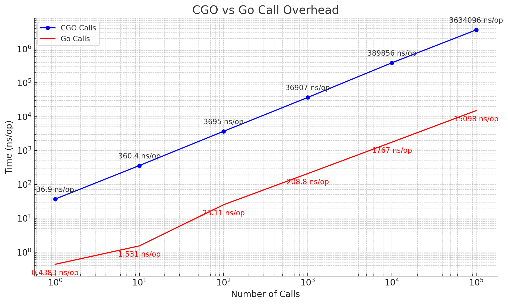

# CGo Call Boundary

    'They say that somewhere out there, beyond the edge of the atmosphere, begins the infinite.' -- Tom Wolfe

## description

The **CGo Call Boundary** is raised as a contributing factor to lack of GPU support amongst the golang community. The cgo-boundary is described in [this](https://groups.google.com/g/golang-nuts/c/LWtdcEOZvWE/m/KLKoXDbeBwAJ) conversation thread in `golang-nuts`. A statistic is available from 2015 states 171ns [here](https://github.com/nikolaydubina/go-featureprocessing).

## definition

the CGo Call Boundary is taken as defined by the overhead of calling the following void function which has no resultant effect:

    void trivialFunction() {
        // Intentionally empty
    }

## results

*The cgo-boundary - 12th Gen Intel(R) Core(TM) i7-1260P*

## build

    make all

## run

    go test -v ./pkg/cgoboundary/ -bench=.

## Results

### 12th Gen Intel(R) Core(TM) i7-1260P (12th Gen Intel NUC)

    > lscpu

    12th Gen Intel(R) Core(TM) i7-1260P 

    > uname -a:
    
    Linux graeme-nuc 6.5.0-17-generic #17~22.04.1-Ubuntu SMP PREEMPT_DYNAMIC Tue Jan 16 14:32:32 UTC 2 x86_64 x86_64 x86_64 GNU/Linux

    BenchmarkCGOOverhead_1-16           	30636319	        36.90 ns/op
    BenchmarkCGOOverhead_10-16          	 3154564	       360.4 ns/op
    BenchmarkCGOOverhead_100-16         	  294876	      3695 ns/op
    BenchmarkCGOOverhead_1000-16        	   32444	     36907 ns/op
    BenchmarkCGOOverhead_10000-16       	    3274	    389856 ns/op
    BenchmarkCGOOverhead_100000-16      	     314	   3634096 ns/op
    BenchmarkNoCGOOverhead_1-16         	1000000000	         0.4383 ns/op
    BenchmarkNoCGOOverhead_10-16        	656971101	         1.531 ns/op
    BenchmarkNoCGOOverhead_100-16       	42457201	        25.11 ns/op
    BenchmarkNoCGOOverhead_1000-16      	 6102603	       208.8 ns/op
    BenchmarkNoCGOOverhead_10000-16     	  696614	      1767 ns/op
    BenchmarkNoCGOOverhead_100000-16    	   89948	     15098 ns/op
    PASS

### Cortex-A78AE (Nvidia Orin Nano)

The following test is using the [`nvcc`](./NVCCMakefile)

    > lscpu

    Cortex-A78AE

    > uname -a

    Linux nano 5.15.122-tegra #1 SMP PREEMPT Mon Dec 18 21:24:25 PST 2023 aarch64 aarch64 aarch64 GNU/Linux

    BenchmarkCGOOverhead_1-6          	 9210998	       131.3 ns/op
    BenchmarkCGOOverhead_10-6         	  891223	      1387 ns/op
    BenchmarkCGOOverhead_100-6        	   85166	     14265 ns/op
    BenchmarkCGOOverhead_1000-6       	    8642	    136845 ns/op
    BenchmarkCGOOverhead_10000-6      	     830	   1392168 ns/op
    BenchmarkCGOOverhead_100000-6     	      88	  13882211 ns/op
    BenchmarkNoCGOOverhead_1-6        	555579051	         2.065 ns/op
    BenchmarkNoCGOOverhead_10-6       	132763626	         8.650 ns/op
    BenchmarkNoCGOOverhead_100-6      	17089426	        71.38 ns/op
    BenchmarkNoCGOOverhead_1000-6     	 1747710	       680.3 ns/op
    BenchmarkNoCGOOverhead_10000-6    	  171499	      6642 ns/op
    BenchmarkNoCGOOverhead_100000-6   	   18082	     68650 ns/op

The following test is using the [`gcc`](./Makefile)

    BenchmarkCGOOverhead_1-6          	 9399174	       127.5 ns/op
    BenchmarkCGOOverhead_10-6         	  878100	      1366 ns/op
    BenchmarkCGOOverhead_100-6        	   86481	     13925 ns/op
    BenchmarkCGOOverhead_1000-6       	    8781	    135889 ns/op
    BenchmarkCGOOverhead_10000-6      	     889	   1360424 ns/op
    BenchmarkCGOOverhead_100000-6     	      91	  13506441 ns/op
    BenchmarkNoCGOOverhead_1-6        	570130852	         2.008 ns/op
    BenchmarkNoCGOOverhead_10-6       	137585584	         8.626 ns/op
    BenchmarkNoCGOOverhead_100-6      	14930108	        71.11 ns/op
    BenchmarkNoCGOOverhead_1000-6     	 1769456	       681.9 ns/op
    BenchmarkNoCGOOverhead_10000-6    	  170923	      6885 ns/op
    BenchmarkNoCGOOverhead_100000-6   	   18092	     68608 ns/op
